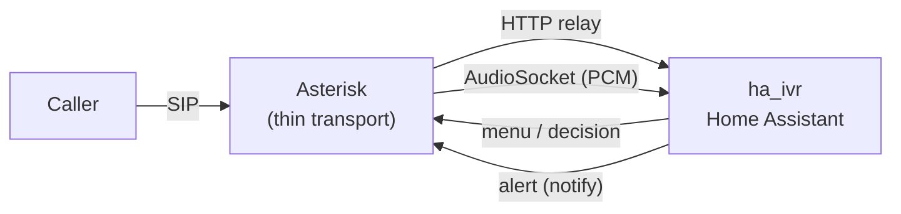

<div align="center">

# asterisk-ha-pbx

**A self-hosted Asterisk PBX — phone menu, voice assistant, and voice
alerts — that connects to the [ha_ivr](https://github.com/meni123/ha-ivr)
Home Assistant integration.**

[עברית](README.md) · [Quick install](INSTALL.md) · [Manual install](INSTALL-manual.md)

</div>

---

## What it is

An installer that builds an **Asterisk 22** PBX on a clean Debian box and
wires it to the **ha_ivr** Home Assistant integration. The result: a phone
line that runs your home — a keypad menu, a free-form voice assistant, and
alerts that ring you and read out what happened.

**All the logic lives in ha_ivr**, in the Home Assistant UI. Asterisk is a
thin transport layer only: it answers the call, passes its state to ha_ivr,
and streams the audio. There is no hard-coded menu and no business logic —
every change is made in Home Assistant, not on the server.

> The advantage: **no external address, domain, or cloud-provider
> registration needed.** Everything runs on your local network.

## What you get

- **DTMF phone menu** — keypresses control devices and read out status.
- **Voice assistant** — free-form conversation with Home Assistant Assist.
- **Proactive voice alerts** — the house calls you and reads out what happened.

## Flow



The call enters Asterisk, which runs a short relay that talks to ha_ivr over
HTTP. For the menu, ha_ivr returns text and keys; for the assistant, the audio
is streamed to ha_ivr over AudioSocket; for an alert, ha_ivr posts to a
listener that places the call.

## Two paths to the voice assistant

1. **AudioSocket (primary, recommended).** Raw PCM audio to ha_ivr — no codec,
   no Opus round-trip. Clean and light.
2. **SIP → HA's built-in assistant (fallback).** A SIP transfer to Home
   Assistant's VoIP extension. Requires the `voip` integration in HA.

## Requirements

- **Debian 13 (trixie)**, clean, root access.
- **Home Assistant** with the
  [ha_ivr](https://github.com/meni123/ha-ivr) integration and a
  "self-hosted PBX" provider record.
- A **SIP trunk** from a telephony provider.

## Install

```bash
sudo bash install.sh --ha <your-HA-address>
```

- **[INSTALL.md](INSTALL.md)** — script install, step by step.
- **[INSTALL-manual.md](INSTALL-manual.md)** — full manual install, no script.

## Architecture

The brain lives in ha_ivr; the server is thin. The contract between them
(request format, AudioSocket protocol) is documented in one authoritative
place — in ha_ivr, under
[`docs/pbx.md`](https://github.com/meni123/ha-ivr/blob/main/docs/pbx.md).

## Security

- Secret files (`config.ini`, `pbx-alert.env`) are mode `600`.
- The AudioSocket protocol is plain TCP with no encryption or authentication
  beyond the UUID — listen only on the local network and firewall the port.
- Never put real tokens or passwords into files committed to the repo.

---

## ⚠️ Disclaimer — read before use

**The software is provided "AS IS", without warranty of any kind, express or
implied. Use of it — entirely and in full — is at your own risk.**

This package builds software from source, changes system configuration,
creates services, opens ports, and places and receives phone calls. This
means:

- **No warranty.** The author is not liable for any damage, loss, failure,
  downtime, data corruption, or any other outcome — direct or indirect —
  arising from installing, using, or the failure of the software.
- **Telephony costs are yours.** Outbound calls (alerts) cost money at your
  provider. A fault, loop, or misconfiguration may generate many calls. You
  are solely responsible for any charges.
- **Security is yours.** You are responsible for securing the server, network,
  ports, and secrets. An exposed PBX is a target for attacks and toll fraud.
- **Law and regulation are yours.** Call recording, emergency calling, and
  telephony licensing are subject to the law in your jurisdiction. You are
  solely responsible for compliance.
- **Back up** before installing. The installer modifies system files.

The software is not affiliated with or endorsed by Asterisk/Sangoma, Home
Assistant, Microsoft (edge-tts), or your SIP provider. All trademarks belong
to their respective owners.

**By installing or using the software, you confirm that you have read and
understood this disclaimer and accept full responsibility.**

---

## License

See [LICENSE](LICENSE) (MIT).
