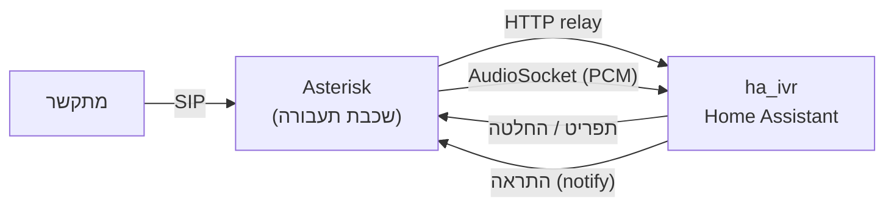

<div align="center">

# asterisk-ha-pbx

**מרכזיית Asterisk עצמאית — תפריט טלפוני, עוזר קולי והתראות קוליות —
תואמת לאינטגרציית [ha_ivr](https://github.com/meni123/ha_ivr) של Home Assistant.**

[English](README.en.md) · [התקנה מהירה](INSTALL.md) · [התקנה ידנית](INSTALL-manual.md)

</div>

---

## מה זה

חבילת התקנה שמקימה מרכזיית **Asterisk 22** על Debian נקי, ומחברת אותה
לאינטגרציית **ha_ivr** של Home Assistant. התוצאה: קו טלפון שמפעיל את
הבית — תפריט הקשה, שיחה חופשית עם עוזר קולי, והתראות שמצלצלות אליך
ומקריאות מה קרה.

**כל הלוגיקה חיה ב-ha_ivr**, בממשק הגרפי של Home Assistant. ה-Asterisk
הוא שכבת תעבורה דקה בלבד — הוא עונה לשיחה, מעביר את מצבה ל-ha_ivr,
ומזרים את האודיו. אין כאן תפריט מקודד ואין לוגיקה עסקית: כל שינוי נעשה
ב-HA, לא בשרת.

> היתרון: **אין צורך בכתובת חיצונית, בדומיין או ברישום מול ספק ענן.**
> הכל עובד ברשת המקומית שלך.

## מה מקבלים

- **תפריט טלפוני (DTMF)** — הקשה מפעילה מכשירים ומקריאה סטטוסים.
- **עוזר קולי** — שיחה חופשית עם ה-Assist של Home Assistant.
- **התראות קוליות יזומות** — הבית מחייג אליך ומקריא מה קרה.

## הזרימה



השיחה נכנסת ל-Asterisk, שמריץ ממסר קצר שמדבר עם ha_ivr ב-HTTP. לתפריט
— ha_ivr מחזיר טקסט ומקשים; לעוזר — האודיו מוזרם ל-ha_ivr דרך
AudioSocket. להתראה — ha_ivr פונה לשרת שמקשיב ומחייג.

## שני מסלולים לעוזר הקולי

1. **AudioSocket (עיקרי, מומלץ).** אודיו PCM גולמי ל-ha_ivr — בלי
   קודק, בלי סבב Opus. מסלול נקי וקל.
2. **SIP → העוזר המובנה של HA (גיבוי).** העברת SIP לשלוחת ה-VoIP של
   Home Assistant. דורש שאינטגרציית `voip` תותקן ב-HA.

## דרישות

- **Debian 13 (trixie)** נקי, גישת root.
- **Home Assistant** עם האינטגרציה
  [ha_ivr](https://github.com/meni123/ha_ivr) ורשומת ספק "מרכזייה עצמית".
- **טראנק SIP** מספק טלפוניה.

## התקנה

```bash
sudo bash install.sh --ha <כתובת-ה-HA-שלך>
```

- **[INSTALL.md](INSTALL.md)** — התקנה עם הסקריפט, צעד-צעד.
- **[INSTALL-manual.md](INSTALL-manual.md)** — התקנה ידנית מלאה, בלי הסקריפט.

## ארכיטקטורה

המוח ב-ha_ivr, השרת דק. החוזה בין השניים (פורמט הבקשות, פרוטוקול
ה-AudioSocket) מתועד במקום אחד סמכותי — ב-ha_ivr, תחת
[`docs/pbx.md`](https://github.com/meni123/ha_ivr/blob/main/docs/pbx.md).

## אבטחה

- קובצי הסודות (`config.ini`, `pbx-alert.env`) במצב `600`.
- פרוטוקול ה-AudioSocket הוא TCP גולמי בלי הצפנה או אימות מעבר ל-UUID —
  יש להאזין רק על הרשת המקומית ולחסום את הפורט בפיירוול מבחוץ.
- אל תכניסו טוקנים או סיסמאות אמיתיים לקבצים שנכנסים למאגר.

---

## ⚠️ הצהרת אחריות — חשוב, קראו לפני השימוש

**התוכנה מסופקת "כמות שהיא" (AS IS), ללא אחריות מכל סוג, מפורשת או
משתמעת. השימוש בה — כולו ובמלואו — על אחריותכם בלבד.**

חבילה זו בונה תוכנה מהמקור, משנה הגדרות מערכת, יוצרת שירותים, פותחת
פורטים, ומבצעת ומקבלת שיחות טלפון. משמעות הדבר:

- **אין כל אחריות.** המחבר אינו אחראי לכל נזק, אובדן, תקלה, השבתה,
  פגיעה בנתונים, או כל תוצאה אחרת — ישירה או עקיפה — הנובעת מהתקנה,
  שימוש, או כשל של התוכנה.
- **עלויות טלפוניה — עליכם.** שיחות יוצאות (התראות) עולות כסף אצל
  הספק שלכם. תקלה, לולאה, או הגדרה שגויה עלולות לייצר שיחות רבות.
  אתם האחראים הבלעדיים לכל חיוב.
- **אבטחה — עליכם.** אתם אחראים לאבטחת השרת, הרשת, הפורטים, והסודות.
  מרכזייה חשופה היא יעד לתקיפות ולחיוב הונאה (toll fraud).
- **חוק ורגולציה — עליכם.** הקלטת שיחות, שיחות חירום, ורישוי טלפוניה
  כפופים לחוק במדינתכם. אתם האחראים הבלעדיים לעמידה בכל דין.
- **גיבוי.** בצעו גיבוי לפני התקנה. ההתקנה משנה קבצי מערכת.

התוכנה אינה מסונפת ואינה מגובה על-ידי Asterisk/Sangoma, Home Assistant,
Microsoft (edge-tts), או ספק ה-SIP שלכם. כל השמות המסחריים שייכים
לבעליהם.

**בהתקנה או בשימוש בתוכנה, אתם מאשרים שקראתם והבנתם הצהרה זו, ומקבלים
עליכם את מלוא האחריות.**

---

## רישיון

ראו [LICENSE](LICENSE) (MIT).
